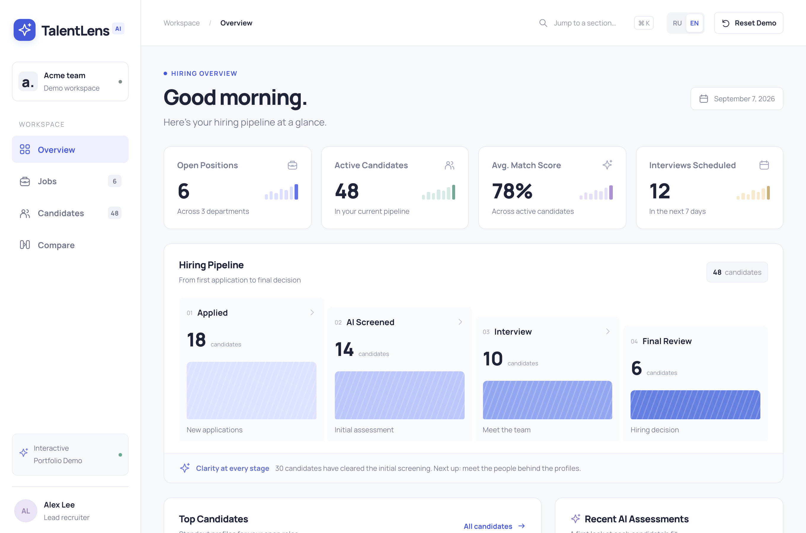
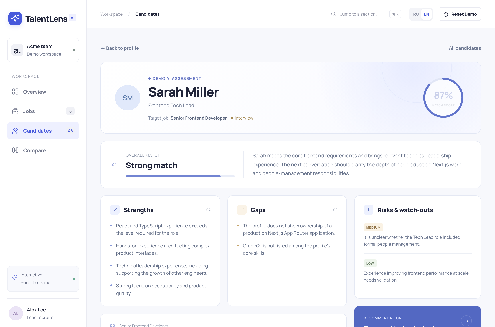
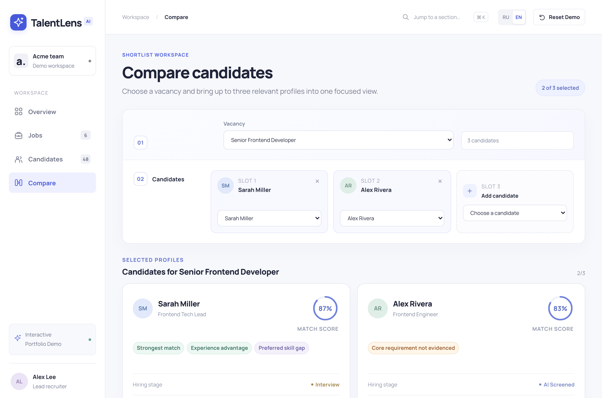
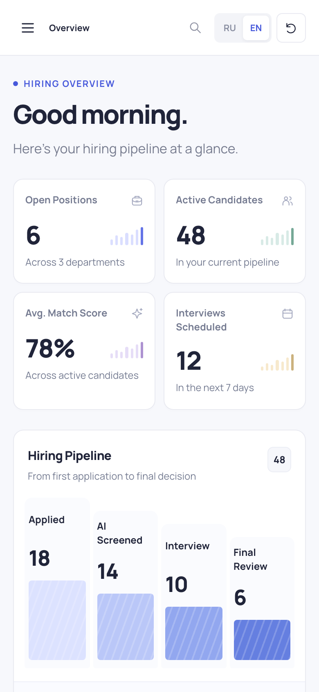

# TalentLens AI

**A portfolio demonstration of an AI-assisted candidate analysis workspace for recruiters.**

TalentLens AI gives a recruiter one place to see a hiring pipeline, review candidates
against a specific role, and read a structured, explainable fit assessment — strengths,
gaps, risks, and a recommendation — instead of a bare match percentage.

- **Who it's for:** recruiters and hiring teams who want a faster, clearer read on "is
  this candidate worth an interview?" across a real pipeline of applicants.
- **The problem it addresses:** resumes and ATS exports are hard to compare quickly; a
  single score without reasoning doesn't help a recruiter defend a decision.
- **What you can try in the demo:** browse a hiring pipeline, open a candidate's full
  AI-style assessment, and compare up to three candidates side by side for the same role.
- **Live demo:** [rbxclubteam-hash.github.io/talentlens-demo](https://rbxclubteam-hash.github.io/talentlens-demo/)
  (current live demo — see [Portfolio scope](#portfolio-scope--limitations) below for how
  this candidate relates to it).

> Portfolio demo. All companies, jobs, and candidates are fictional. Assessments are
> clearly labeled **Demo AI Assessment** and are deterministic, pre-written content — no
> AI API is called and no real hiring decision is made by this demo.

---

## Screenshots

| Hiring overview | Candidate AI assessment |
| --- | --- |
|  |  |

| Side-by-side candidate comparison | Mobile |
| --- | --- |
|  |  |

---

## Business problem

Recruiters triaging a real pipeline face two recurring problems: it's slow to compare
many candidates against one role consistently, and a bare "match score" doesn't explain
*why* — so it doesn't help make or defend a decision. TalentLens AI's answer is a
structured assessment (strengths, gaps, risks, recommendation) attached to every
candidate, plus a workspace built around a live pipeline instead of a static list.

## Solution

- A **hiring overview** dashboard: open positions, active candidates, average match
  score, upcoming interviews, and a four-stage pipeline (Applied → AI Screened →
  Interview → Final Review).
- A **candidate directory** with search, filters, and sorting, linked to real jobs.
- A **structured assessment** per candidate: overall match verdict, strengths, gaps,
  risks with severity, and a recruiter recommendation — not just a number.
- A **side-by-side comparison** of up to three candidates for one role, with
  evidence-based differences instead of an automatic "winner."

## Core workflow

`Overview → Candidates → Candidate assessment → Compare`

1. **Overview** — see the pipeline at a glance and jump into top candidates or recent
   assessments.
2. **Candidates** — search and filter a pipeline of profiles linked to open roles.
3. **Assessment** — open a candidate to see role fit, résumé context, hiring-stage
   progress, and the full Demo AI Assessment (strengths / gaps / risks / recommendation).
4. **Compare** — pick a vacancy and up to three candidates to see them side by side.

`Cmd/Ctrl+K` opens a command palette to jump straight to any section. **Reset Demo**
restores the original dataset at any time.

## Key capabilities

- Bilingual UI (**English** default, **Russian** secondary) with a persistent toggle.
- Session-local create/edit actions on jobs and candidates that stay in sync with the
  pipeline, funnel counts, and featured profiles — useful for showing the workspace
  responding to real input, not just displaying static data.
- Explicit **Demo AI Assessment** labeling wherever generated-looking content appears, so
  it's never mistaken for a live model call.

## What's real application behavior vs. demo data

- **Real:** the UI, the state management, the search/filter/sort logic, the candidate ↔
  job linking, the comparison logic, and the bilingual rendering all run for real in your
  browser.
- **Demo data:** the roles, candidates, résumé details, and written assessments are
  fictional and fixed. The four featured profiles carry hand-written, tailored
  assessments; other profiles reuse their existing candidate and job data. Nothing here
  is a live AI call, an upload pipeline, or a production hiring decision.

## Architecture / stack

| Layer | Technology |
| --- | --- |
| Framework | Next.js (App Router), static export (`output: "export"`) |
| Language | TypeScript, React |
| Styling | Hand-written CSS modules per section |
| Data | Local, in-memory demo dataset (no backend, no database, no auth) |
| Hosting | Static files on GitHub Pages |

There is no backend service, API route, upload endpoint, or authentication in this demo —
everything runs client-side against local demo data.

## Run locally

Requires Node.js.

```bash
npm install
npm run dev
```

Open the printed local URL. The app loads in **English** by default; use the **RU / EN**
toggle in the header to switch. `Cmd/Ctrl+K` opens the command palette. **Reset Demo**
returns to the original dataset.

## Checks

```bash
npm run typecheck
npm run lint
npm run build
```

`npm run build` produces a static export in `out/`. For a root-path local preview:

```bash
npm run start
```

For GitHub Pages or another subpath host, set the deployment path at build time (Next.js
embeds it in the client bundle, so rebuild whenever the path changes):

```bash
NEXT_PUBLIC_BASE_PATH=/repository-name npm run build
```

## Demo walkthrough

A short, exact path through the strongest workflow is in
[`docs/DEMO.md`](docs/DEMO.md).

## Portfolio scope / limitations

This is a **portfolio demo**, not a production recruiting product:

- No real AI/model API is called; assessments are deterministic, pre-written demo
  content, explicitly labeled as such in the UI.
- No backend, database, authentication, file uploads, or real candidate/company data.
- No invented usage numbers, customers, or hiring outcomes — this README and the app
  describe only what the demo actually does.
- The public demo link above points at the **currently deployed** build. This candidate
  is a portfolio-preparation pass over the source (English-default, documentation,
  screenshots) and is reviewed before it replaces what's live.

See [`docs/CASE_STUDY.md`](docs/CASE_STUDY.md) for a fuller write-up of the problem,
approach, and what this project demonstrates to a potential client.
